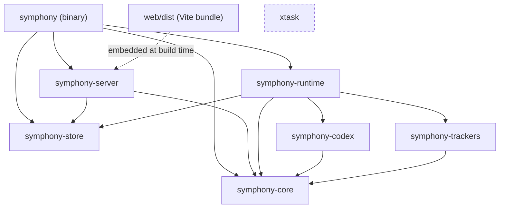

# Symphony architecture (Rust)

Symphony is a long-running daemon. It polls one issue tracker, gives every eligible issue an
isolated workspace, and drives a Codex `app-server` session in it until the issue leaves its
active states. This page explains how the Rust workspace is put together. The behavioural
contract is [`SPEC.md`](../SPEC.md), the HTTP contract is [`api/openapi.yaml`](api/openapi.yaml),
and the differences from the Elixir reference implementation are in
[`migration-from-elixir.md`](migration-from-elixir.md).

## Crate map

| Crate | Owns | Notable dependencies |
|---|---|---|
| `symphony-core` | `WORKFLOW.md` loading and last-known-good reload (`WorkflowStore`), config casting and validation (exact error texts), `Issue`, Liquid prompt rendering, path safety, workspace keys | `serde_yaml_ng`, `liquid`, `arc-swap`; no networking |
| `symphony-trackers` | `Tracker` trait; Memory, Linear, GitHub, GitLab, Jira and Asana adapters; HTTP transport with retry/redirect parity and credential scrubbing; the agent's tracker tools (`linear_graphql`, `github_api`, ...) | `reqwest` (rustls/aws-lc) |
| `symphony-codex` | Codex `app-server` client: process launch (`bash -lc`, process groups), JSON-RPC over stdio, turn streaming, events, dynamic-tool dispatch through a `DynamicToolHandler` trait, token accounting | `tokio::process` |
| `symphony-store` | SQLite run history: runs, per-run events, token usage, retention; one dedicated DB thread, fire-and-forget writes | `rusqlite` (bundled SQLite, WAL) |
| `symphony-runtime` | The orchestrator actor (scheduling state, dispatch, retries, reconciliation), agent runner, workspace manager and hooks, SSH workers, supervisor, snapshot model, `RuntimeHandle`, run recorder | the four crates above |
| `symphony-server` | axum HTTP server: Elixir-compatible `/api/v1` routes, health, SSE, run history endpoints, OpenAPI JSON, the embedded web UI; defines the `ControlPlane` trait it serves | `axum`, `tower-http` |
| `symphony` | The binary: clap CLI and guardrail banner, bootstrap, logging, terminal status dashboard, `workspace before-remove` subcommand; implements `ControlPlane` over `RuntimeHandle` | everything |
| `xtask` | Repository chores (`pr-body-check`); never shipped | |
| `web/` | Preact + Vite dashboard, built to `web/dist` and embedded by `symphony-server` at compile time | |



Rules that keep the graph acyclic and the builds fast:

- `symphony-core` has no network or server dependencies, so the config and prompt tests compile
  quickly.
- `symphony-codex` does not know about trackers. It calls a `DynamicToolHandler` trait, and the
  runtime implements that trait by routing tool calls to the active tracker's tools.
- `symphony-server` does not depend on the runtime. It serves anything that implements
  `ControlPlane` (snapshot, refresh, generation counter); the binary adapts `RuntimeHandle` to it.
  This lets the server be tested against fakes and keeps axum out of the runtime.
- `symphony-store` depends on no other Symphony crate.
- Shared third-party versions live in the root `[workspace.dependencies]`.

## Runtime topology

```text
main()
 ├─ cli::parse()                  exits 1 with the usage / guardrails banner on error
 ├─ logging::init(logs_root)      rotating file sink (10 MiB × 5)
 ├─ WorkflowStore::start(path)?   a bad workflow refuses to boot; afterwards it reloads every 1 s
 ├─ Store::open(SYMPHONY_DB_PATH) mark_interrupted_runs(), prune(retention) (+ every 24 h)
 ├─ ctx = Arc<AppContext { workflow store, store, generation: watch<u64>, shutdown token, ... }>
 ├─ spawn supervise("agent_runtime", Runtime::run)   orchestrator task + JoinSet of agent runs
 ├─ if a port is configured: spawn symphony_server::serve(ControlPlane, store)
 ├─ if observability.dashboard_enabled: spawn the terminal status dashboard
 └─ select! { SIGINT | SIGTERM => shutdown.cancel(), runtime fatal => exit(1) }
     then abort workers (kills codex / ssh / hook process groups), flush the store, exit 0
```

Invariants carried over from the Elixir OTP design:

1. **One mutation authority.** Only the orchestrator task mutates scheduling state (running,
   claimed, retrying, blocked, totals, rate limits). Agent runs report by message; a `run_id`
   filters stale messages.
2. **Timers carry tokens.** A tick or retry timer that fires after being superseded is ignored
   by comparing tokens, not only by cancelling it.
3. **Orchestrator failure kills every agent.** The supervisor drops the `JoinSet` (aborting all
   runs, whose child processes die with their process groups) and starts a fresh orchestrator,
   which re-runs startup cleanup and re-dispatches from the tracker. More than 3 restarts in 5 s
   ends the process with exit 1.
4. **Config is pull-based.** Consumers read the last-known-good settings on every operation; the
   orchestrator force-validates the workflow before each dispatch.
5. **Secrets never reach Codex.** Tracker credentials are removed from the child environment and
   `unset` in the login shell; tracker writes go through host-side dynamic tools.

## Data flow of one issue

```mermaid
sequenceDiagram
    autonumber
    participant T as Tracker
    participant O as Orchestrator
    participant A as Agent run
    participant W as Workspace + hooks
    participant C as codex app-server
    participant S as SQLite store
    O->>T: fetch issues in active states (every polling.interval_ms)
    O->>O: reconcile running/blocked, sort by priority, check slots and labels
    O->>T: revalidate the candidate by id
    O->>A: dispatch (JoinSet), claim the issue
    A->>S: start_run (via RunRecorder, fire-and-forget)
    A->>W: create or reuse the workspace, after_create (new only), before_run
    A->>C: initialize → thread/start (dynamic tools)
    loop up to agent.max_turns
        A->>C: turn/start with the rendered prompt
        C-->>A: streamed events, tool calls (→ tracker tools), token usage
        A-->>O: worker updates (last event, tokens, rate limits)
        A->>S: events, token usage, turn count
        A->>T: refresh the issue; stop if it is no longer active
    end
    A->>W: after_run
    A-->>O: exit (normal / error / input required)
    A->>S: finish_run (succeeded / failed / blocked / cancelled)
    O->>O: normal → continuation re-check in 1 s; error → retry with backoff; input required → blocked
    O->>T: on reconcile, a terminal state → stop the run, before_remove, delete the workspace
```

Retry delay after a failure is `min(10 s · 2^(attempt-1), agent.max_retry_backoff_ms)`. A normal
exit schedules a 1 s continuation that either dispatches the issue again, releases the claim (the
issue is inactive or gone), or cleans the workspace (the issue is terminal).

## Live monitoring

There are three layers, each usable on its own:

1. **Live state (in memory).** The orchestrator owns the authoritative snapshot (running, retrying,
   blocked, totals, rate limits). Every state change bumps a `tokio::sync::watch<u64>`
   *generation* counter. `GET /api/v1/state` asks the orchestrator for a snapshot with a 15 s
   timeout and always answers 200 (failures are reported in-band, as in Elixir).
2. **Push (SSE).** `GET /api/v1/events` streams `snapshot` events.
   - One hub task per server watches the generation counter, debounces changes (~200 ms, leading
     and trailing edge), takes **one** snapshot and shares the encoded JSON with all clients, so
     orchestrator load does not grow with the number of browsers, and nothing is snapshotted while
     no one is connected.
   - Every event is a complete snapshot with `id:` = generation; there is no replay, so
     `Last-Event-ID` reconnects simply get the current state.
   - `retry: 3000` and a `heartbeat` event every 15 s keep proxies and clients honest.
3. **History (SQLite).** The run recorder writes each run, its events (throttled deltas), token
   usage and outcome to `symphony-store`. `GET /api/v1/runs`, `/runs/{id}`, `/runs/{id}/events`
   and `/totals` read it. History survives restarts; runs left `running` by a crash are closed as
   `cancelled` at the next start, and `SYMPHONY_DB_RETENTION_DAYS` bounds its size.

The web dashboard (`web/src/live/liveSource.ts`) combines them: it opens an `EventSource`,
reconnects with exponential backoff (1 s to 30 s, ±20 % jitter), treats 45 s of silence as a dead
stream, falls back to polling `GET /api/v1/state` every 5 s after 3 failures (re-probing SSE every
60 s), and keeps the last good state on screen while offline. Runtime counters tick locally every
second. History pages read the run endpoints, and a running run's detail view refreshes every 5 s.
The terminal status dashboard subscribes to the same generation counter in-process.

### Why SSE rather than WebSockets

- **The traffic is one-way.** The server pushes state; the only client action, "refresh now", is
  a rare `POST /api/v1/refresh`. A bidirectional socket buys nothing.
- **It is plain HTTP.** It works through ordinary reverse proxies, load balancers and auth
  gateways, needs no `Upgrade` handling, multiplexes over HTTP/2, and can be read with
  `curl -N`.
- **Reconnection is built in.** `EventSource` reconnects by itself (`retry:`, `Last-Event-ID`).
  Because every event is a full snapshot, a reconnect never needs a replay protocol.
- **It is simpler on both ends.** axum's `Sse` response plus a `watch` channel on the server, a
  few lines of `EventSource` in the browser, and a trivial polling fallback that uses the exact
  same JSON.
- **The trade-offs are known and handled.** Proxies must not buffer the stream (see
  [`deployment.md`](deployment.md#reverse-proxy-and-sse)); HTTP/1.1 browsers cap connections per
  origin, which one stream per tab stays well within; the payload is text (JSON) anyway.
